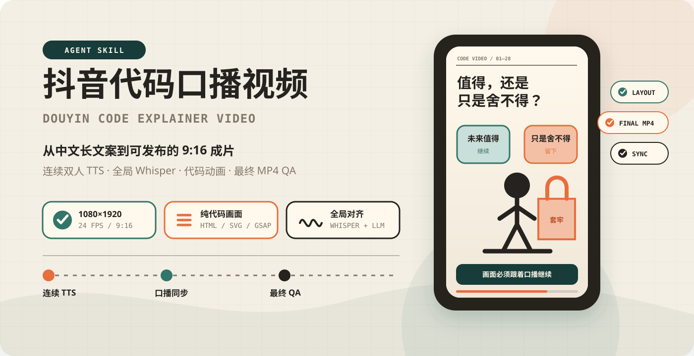

<p align="center">
  
</p>

<p align="center">
  <a href="https://github.com/Mr-funny/hbg-douyin-code-explainer-video/actions/workflows/ci.yml"></a>
  
  
  
  
  
  
</p>

<p align="center">
  把中文观点、知识、职场和成长文案做成<strong>可直接发布的 9:16 代码动画口播视频</strong>。<br />
  <strong>双人对话 · 全局语音对齐 · 画面不断档 · BGM 不抽吸 · 最终成片逐帧把关</strong>
</p>

<a id="agent-install"></a>

## ⚡ 一句话安装进 Agent

把下面整段话直接发给 Codex、Claude Code，或其他支持 `SKILL.md` 的 Agent：

```text
请从 https://github.com/Mr-funny/hbg-douyin-code-explainer-video 安装
hbg-douyin-code-explainer-video skill。

请自动识别当前 Agent 的全局 skills 目录；如果已经存在旧版本，请先备份再更新。
安装后检查 SKILL.md、references 和 scripts 是否完整，并运行 bash -n 检查两个脚本。
不要读取、打印或上传任何本地 TTS 模型、音色、API Key、视频、音频或项目素材。

验证完成后，告诉我如何使用 $hbg-douyin-code-explainer-video
把中文长文案制作成双人对话式 1080×1920 抖音代码动画视频。
```

Agent 会完成：

```text
识别当前 Agent
→ 下载 Skill
→ 备份旧版本
→ 安装核心文件
→ 校验脚本
→ 告诉你如何调用
```

安装后直接说：

```text
使用 $hbg-douyin-code-explainer-video 处理下面的文案。
先拆男女角色和语义场景，再生成连续 TTS，使用全局 Whisper 对齐，
最后制作 1080×1920 的代码动画并完成最终 MP4 视觉与媒体质检。
```

| 纯代码画面 | 连续对话 | 全局对齐 | 最终质检 |
|:---:|:---:|:---:|:---:|
| HTML / CSS / SVG / GSAP | 按说话人语义段生成 | Whisper 贴回真实时间 | 检查编码后的 MP4 |

## 🎯 它解决的不是“能渲染”，而是“能交付”

程序化视频最容易出现的低级问题，往往不是代码报错，而是代码完全能跑、画面却不合理：

| 常见问题 | Skill 的处理方式 |
|---|---|
| 横屏尺寸或竖屏安全区错误 | 强制 1080×1920、24fps 和抖音安全区 |
| 人物悬空、绳索断开、箭头偏移 | 先声明几何不变量，再做前 / 中 / 后帧检查 |
| 结论、数字或标签提前出现 | 将所有结果文本设为显式阶段揭示 |
| 口播还在继续，画面已经停住 | 每个语义段持续保留有效动作或进度 |
| 转场出现空白、黑闪或半张空页面 | 检查每一个转场中点，前后场共同铺满画布 |
| TTS 被切成几十个小片段，情绪断裂 | 按男女完整语义轮次生成，不按视觉场景碎切 |
| 字幕使用 ASR 同音错字 | Whisper 只负责时间，显示文本保留校正文案 |
| BGM 每句话忽大忽小 | 默认稳定增益和交叉循环，不做逐句音量抽吸 |
| 浏览器预览正常，最终 MP4 出错 | 必须重新抽取最终编码视频的关键帧检查 |

> [!IMPORTANT]
> 自动检查通过不等于视频完成。只有源帧、转场中点、关键运动关系和最终编码 MP4 都检查通过，才允许交付。

## ✨ 核心能力

| 模块 | 能力 |
|---|---|
| 文案分析 | 修正 ASR 错字、拆男女对话、识别观点与视觉隐喻 |
| TTS | 本地 Qwen CustomVoice 优先，支持 Edge TTS 切换与超长文本回退 |
| 连续性 | 按说话人轮次生成长语义块，避免按镜头碎切造成情感断裂 |
| 对齐 | 对最终语速音频执行一次全局 Whisper，再贴回完整场景列表 |
| 视觉 | 仅使用 HTML / CSS / SVG / Canvas / GSAP，不使用生图或生视频素材 |
| 动画 | 画面动作与口播阶段同步，结论、金额、公式和数字不提前揭示 |
| 转场 | 以连续横向推页为主，转场期间始终保持有效内容覆盖画布 |
| BGM | 稳定交叉循环、首尾淡入淡出，可选慢速 ducking |
| QA | HyperFrames 检查、源帧检查、最终 MP4 抽帧、黑帧与静音检测 |
| 发布规格 | H.264、yuv420p、1080×1920、24fps、AAC 双声道 48kHz、faststart |

## 🚀 快速开始

### 方法一：让 Agent 自动安装（推荐）

复制 README 首屏的[自然语言安装提示](#agent-install)发给 Agent。它会识别自己的 skills 目录、备份旧版本并完成校验。

### 方法二：安装到 Codex

```bash
curl -fsSL https://raw.githubusercontent.com/Mr-funny/hbg-douyin-code-explainer-video/main/install.sh | sh
```

默认安装到：

```text
${CODEX_HOME}/skills/hbg-douyin-code-explainer-video
```

如果没有设置 `CODEX_HOME`，则使用：

```text
~/.codex/skills/hbg-douyin-code-explainer-video
```

### 方法三：安装到 Claude Code

```bash
curl -fsSL https://raw.githubusercontent.com/Mr-funny/hbg-douyin-code-explainer-video/main/install.sh | sh -s -- --claude
```

### 方法四：手动安装

```bash
git clone https://github.com/Mr-funny/hbg-douyin-code-explainer-video.git
mkdir -p ~/.codex/skills/hbg-douyin-code-explainer-video
cp SKILL.md ~/.codex/skills/hbg-douyin-code-explainer-video/
cp -R agents references scripts ~/.codex/skills/hbg-douyin-code-explainer-video/
```

## 🤖 使用示例

### 长篇观点文案

```text
使用 $hbg-douyin-code-explainer-video，把这篇“沉没成本”文案制作成抖音竖屏视频。
前面的疑问与人物原话使用女声，解释部分使用男声。
画面只用代码绘制，不准使用生图或生视频工具。
```

### 数学或概率讲解

```text
使用 $hbg-douyin-code-explainer-video 处理这篇贝叶斯定理文案。
口播使用自然中文，画面公式显示标准数学记号。
所有数字和最终概率必须在对应口播出现后才揭示。
```

### 指定 Edge TTS

```text
使用 $hbg-douyin-code-explainer-video。
这次使用 Edge TTS 男女两个音色，语速 +20%，
先生成完整说话人段落，再全局 Whisper 对齐，不要按视觉场景切音频。
```

### 修复已有代码视频

```text
使用 $hbg-douyin-code-explainer-video 检查这个 HyperFrames 项目。
重点排查人物悬空、元素错位、提前露出、空白转场、BGM 抽吸和最终 MP4 编码问题。
发现问题后生成新的修订文件，不覆盖旧审片版本。
```

## 🧠 工作原理

```mermaid
flowchart LR
    A["中文长文案"] --> B["纠错与角色切分"]
    B --> C["说话人连续 TTS"]
    C --> D["最终语速音频"]
    D --> E["全局 Whisper"]
    E --> F["LLM 逐场复核"]
    F --> G["分镜 + DESIGN.md"]
    G --> H["HyperFrames 代码动画"]
    H --> I["稳定 BGM 混音"]
    I --> J["源帧视觉 QA"]
    J --> K["最终 MP4 QA"]
    K --> L["抖音发布文件"]
```



关键原则：

1. **声音先连续，再拆视觉。** 男女角色是硬边界，视觉镜头不是音频硬边界。
2. **Whisper 只负责真实时间。** 校正文案才是字幕与画面显示的来源。
3. **静态布局先正确，再添加动画。** 不用动画掩盖错误的最终位置。
4. **最终编码文件才是交付对象。** 浏览器源帧不能替代 MP4 检查。

## 🔊 音频与 BGM

### TTS 后端选择

| 场景 | 推荐方案 |
|---|---|
| 本地 Qwen 稳定、需要克隆或定制音色 | Qwen CustomVoice |
| 用户明确指定 Edge、Qwen 长文本阻塞 | Edge TTS |
| 女声疑问、人物原话 | Qwen `Vivian` 或指定 Edge 女声 |
| 男声解释、归纳和结论 | Qwen `Uncle_Fu` 或指定 Edge 男声 |

默认语速：Qwen 完整音轨统一 `1.3×`；Edge 生成时 `+20%`。只能应用一次，不能在 TTS 和后期同时加速。

### 稳定 BGM 混音

```bash
BGM_MODE=stable \
BGM_VOLUME=0.46 \
BGM_CROSSFADE_SECONDS=5 \
BGM_FADE_IN_SECONDS=2.5 \
BGM_FADE_OUT_SECONDS=3 \
scripts/mix_bgm.sh voice-video.mp4 bgm.mp3 final.mp4
```

如果 BGM 头尾包含不适合循环的部分：

```bash
BGM_TRIM_START_SECONDS=96 \
BGM_TRIM_END_SECONDS=143 \
scripts/mix_bgm.sh voice-video.mp4 bgm.mp3 final.mp4
```

只有音乐明显遮住人声时才使用：

```bash
BGM_MODE=ducked scripts/mix_bgm.sh voice-video.mp4 bgm.mp3 final.mp4
```

## ✅ 最终媒体质检

```bash
scripts/final_media_qa.sh final.mp4 qa/final
```

输出包括：

- `ffprobe.json`
- `blackdetect.log`
- `silencedetect.log`
- `loudness.log`
- 文件与视频流 SHA-256
- 全片联系表
- 10%、25%、50%、75%、90% 全分辨率抽帧
- H.264、yuv420p、竖屏尺寸、24fps、AAC、48kHz、双声道与 faststart 检查

指定人物接地、绳索端点、数字揭示和转场中点等高风险时间：

```text
1.450	person-ground-before
3.760	person-ground-mid
5.940	person-ground-after
```

```bash
QA_TIMESTAMPS_FILE=qa-timestamps.tsv \
scripts/final_media_qa.sh final.mp4 qa/final
```

这些时间点会以 PNG 从最终编码 MP4 中重新抽取，不能用浏览器截图代替。

## 🧪 真实流程验证

这套 Skill 已在一条 197.29 秒的双人中文长视频上完成集成验证：

| 指标 | 结果 |
|---|---:|
| 画布 | 1080×1920 |
| 帧率 | 24fps |
| 总帧数 | 4735 |
| 视频编码 | H.264 High / yuv420p |
| 音频编码 | AAC-LC / 48kHz / stereo |
| 全局 Whisper 场景覆盖 | 28 / 28 |
| 黑帧事件 | 0 |
| 异常静音事件 | 0 |
| 综合响度 | -20.5 LUFS |
| True Peak | -1.2 dBFS |

同时使用短 BGM 自动重复为 4 秒测试视频构建多段交叉循环，验证了稳定混音脚本的循环、编码和 QA 输出。

## 🧰 环境要求

| 依赖 | 用途 |
|---|---|
| Node.js 22+ | HyperFrames CLI 与渲染 |
| FFmpeg / FFprobe | 混音、编码、抽帧和媒体检查 |
| HyperFrames | HTML 视频时间线、检查和渲染 |
| GSAP | 确定性代码动画 |
| Qwen CustomVoice（可选） | 本地定制或克隆音色 |
| Edge TTS（可选） | 云端神经语音回退或指定方案 |
| Whisper large-v3-turbo | 全局中文语音时间对齐 |

本仓库是 Agent Skill，不捆绑模型权重、音色文件、音乐、视频素材或用户项目。

## 🗂️ 项目结构

```text
hbg-douyin-code-explainer-video/
├── SKILL.md                       # Agent 核心工作流
├── agents/openai.yaml             # Skill UI 元数据
├── references/
│   ├── audio-pipeline.md          # 连续 TTS、Whisper 与稳定 BGM
│   └── qa-checklist.md            # 强制视觉与媒体检查表
├── scripts/
│   ├── mix_bgm.sh                 # 稳定交叉循环与可选 ducking
│   └── final_media_qa.sh          # 最终 MP4 自动检查与抽帧
├── docs/showcase/hero.svg         # README 代码绘制横幅
├── .github/workflows/ci.yml       # Skill 与脚本基础校验
└── install.sh                     # Codex / Claude Code 安装器
```

## 🔐 隐私与素材边界

- 不读取、上传或提交用户本地 Qwen 模型和克隆音色。
- 不在仓库中保存 API Key、环境变量、项目视频、音频或 BGM。
- 画面默认只使用代码绘制，不把生成式图片或视频偷偷混入项目。
- 使用第三方音乐、字体或语音服务时，发布前仍需确认对应许可和平台条款。
- Agent 在执行 Git、上传、发布或删除操作前，仍需遵守用户授权范围。

## 📄 关于仓库

这个仓库保存的是可安装的 Agent Skill 与确定性辅助脚本。核心目标不是提供一套固定模板，而是让 Agent 在面对不同中文文案时，始终遵守同一套音频连续性、画面同步和最终质量门槛。
